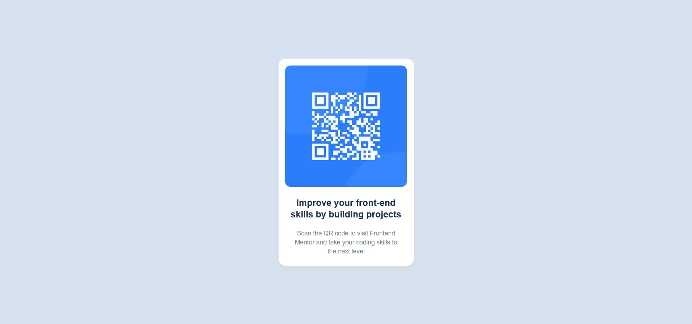

# Frontend Mentor - QR code component solution

This is a solution to the [QR code component challenge on Frontend Mentor](https://www.frontendmentor.io/challenges/qr-code-component-iux_sIO_H).

## Table of contents

- [Overview](#overview)
  - [Screenshot](#screenshot)
  - [Links](#links)
- [My process](#my-process)
  - [Built with](#built-with)
  - [What I learned](#what-i-learned)
  - [Continued development](#continued-development)
  - [Useful resources](#useful-resources)
- [Author](#author)
- [Acknowledgments](#acknowledgments)

## Overview

This is a simple qr code page built as a starter project on Frontend Mentor.

### Screenshot

### Links

- Solution URL: (https://your-solution-url.com)
- Live Site URL: (https://your-live-site-url.com)

## My process

- Planned out the design/layout of elements
- Create base HTML skeleton and added CSS features as required
- Referred to style guide for appropriate font-size and color

### Built with

- Semantic HTML5 markup
- CSS custom properties
- CSS Grid

### What I learned

- Learnt how to use grid (i.e. center a div!)
- Use responsive units for size

### Useful resources

- https://css-tricks.com/centering-css-complete-guide/ - This helped me learn how to center elements using different techniques.

## Author

- Website - [Harshil Kabra](https://www.kabraharshil.wordpress.com)
- Frontend Mentor - [@harshilkabra](https://www.frontendmentor.io/profile/harshilkabra)
- Twitter - [@harshilkabra](https://twitter.com/harshilkabra)

**Note: Delete this note and add/remove/edit lines above based on what links you'd like to share.**
